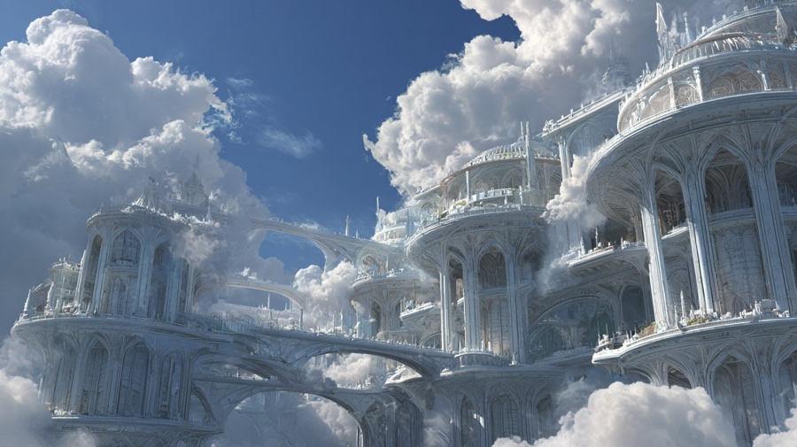

# Cirrus Vale



**Air Quad Housing | Air Quad (East)**

Housing that looks like spun silver clouds solidified into architecture. Walkways are semi-transparent mist. Elevator gusts — vertical wind currents — lift students between floors in place of conventional stairs or lifts.

## Midjourney Prompts

### External View

```
dragon dormitory buildings that look like solidified silver clouds, semi-transparent misty walkways connecting them, vertical wind current elevator shafts visible as columns of upward-rushing air lifting dragons between floors, the entire complex blending with actual clouds, air quad floating setting, silver and white ethereal aesthetic, epic fantasy cloud-housing --ar 16:9 --style raw
```
